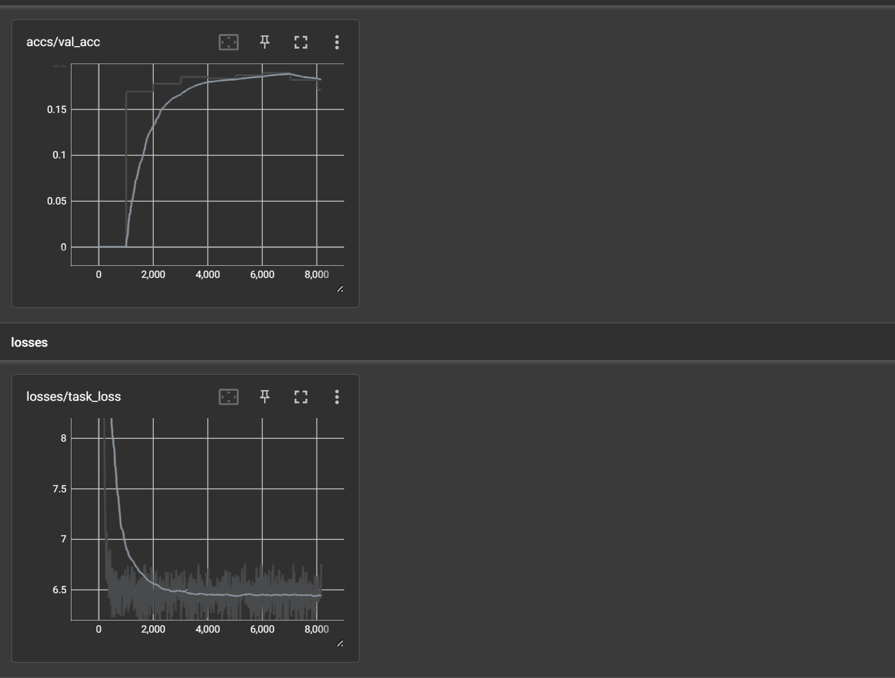
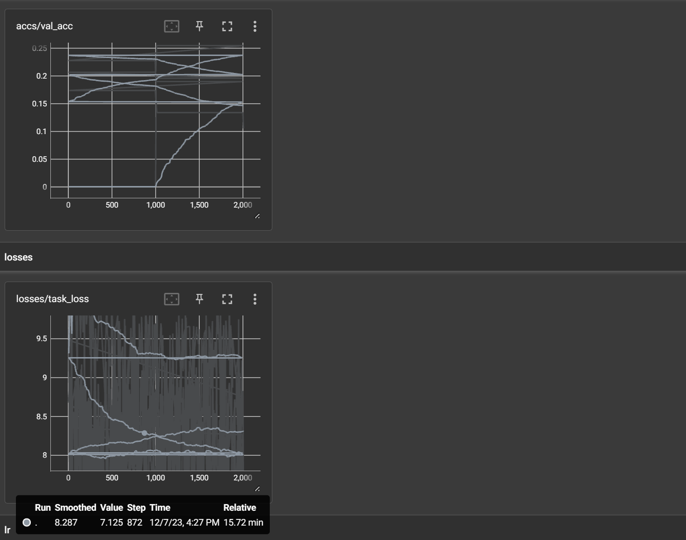
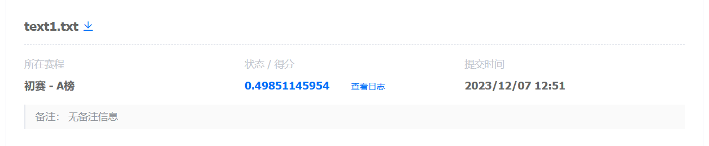
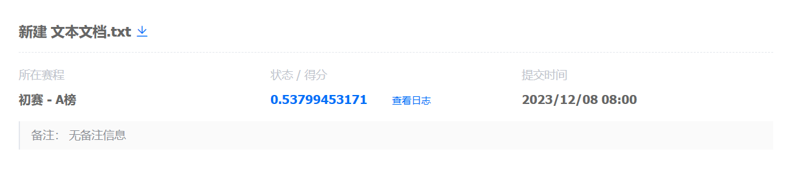
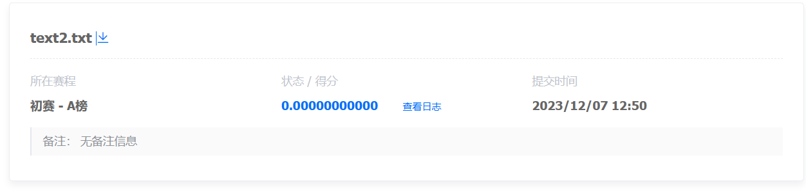
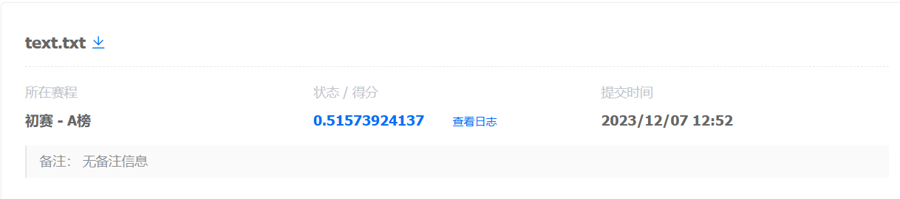

##多语言混合模型大赛程序
## 1 程序的基本结构
项目文件由四部分组成，分别是数据处理、Lora模块搭插入，模型运行以及bleu平均值评估。  
**数据处理**：将txt文本中的数据通过tokenizer处理为可输入模型的张量形式。  
**LoRA模块插入**：由于直接对大语言模型整体进行下游任务的微调可能会导致模型在原本任务上的表现性能变差、泛化能力降低。同时，直接对模型全局微调开销较大，成本较高。  
**模型运行**：在该文件中，可以直接对于模型的训练超参进行详细的调优。  
**bleu评估**：BLEU使用N-gram作为翻译质量的度量单位。N-gram是指连续的N个词的序列。BLEU计算机器翻译结果中N-gram在参考翻译中出现的频率，以此来度量翻译的准确性。
##2 环境安装
###2.1 安装需求
- Linux or Windows
- Python 3.6+
- PyTorch 1.10.0+
- CUDA 10.2+
- transformers 4.26.0+ 
###2.2 创建conda环境并激活
		conda create -n python python=3.6
   		conda activate python
##3 数据处理部分
处理的数据分为训练集、验证集和测试集，分别使用了不同的类，如果有新的数据类型需要加入，那么就采用如下方法：  

	class NMTdata(Dataset):
	    def __init__(self,data_name):
			pass	                                                         
	    def __getitem__(self,item):
	        return {
	            'input_ids':self.dataset['input_ids'][item],
	            'attention_mask':self.dataset['attention_mask'][item],
	            'labels':self.dataset['labels'][item]
	        }
	
	
	    def __len__(self):
	        return self.length
	    def read_data_nmt(self,data_name):
	        text = []
	        labels = []
	        data_dir = '' #自己的数据路径
	        with open(os.path.join(data_dir, data_name), 'r', encoding='utf-8') as f:
	            read_txt = f.read()
	            lines = read_txt.split('\n')
	            for line in lines:
	                x = line.split('\t')
	                if len(x) < 2:
	                    continue
	                else:
	                    text.append(x[0])
	                    labels.append(x[1])
	            return text, labels
##4 LoRA方法的引入
* 句子表示：LoRA首先将输入的句子进行分词或者字符级别的编码，得到一个序列。每个序列中的元素被表示为一个向量，可以使用预训练的词嵌入或字符嵌入来表示。
* 局部关注：LoRA通过引入局部关注机制，对句子中的每个位置进行关注权重的计算。这个局部关注机制通过在每个位置上应用自注意力机制，计算出该位置与其他位置之间的相关性得分。
* 全局汇聚：为了得到句子级别的语义表示，LoRA对所有位置的局部关注权重进行汇聚。这可以通过简单地对所有位置的向量进行加权平均来实现，其中权重由局部关注机制计算得出。
* 多层结构：为了增强模型的表达能力，LoRA可以使用多层的局部关注和全局汇聚结构。每一层的局部关注机制都可以关注不同的信息，从而逐渐捕捉更广泛的语义信息。
##5 实验结果
实验采用的模型是hugging face的两个开源模型M2M100和mBart-50，二者均是已经预训练好的多语言混合翻译数据集，能够完成多对语言的互相翻译任务。  
M2M100训练结果如下：

mBart-50训练结果如下：
 
在网站上进行最终测试时，两个模型评测集相对于微调之前的增长为0.49->0.51和0.0->0.53   
###M2M100:  
微调之前：

微调之后：

###mBart-50
微调之前：

微调之后：

